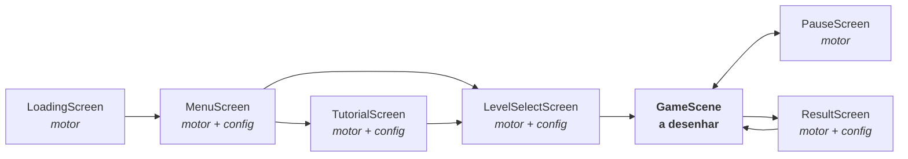

# PLANO-VISUAL-JOGO-DAS-FORMAS.md — layout e direção visual

Plano visual do **Jogo das Formas** (`jogo-das-formas`). Especifica o que aparece na tela, com
que tamanho e em que posição, usando **apenas o que o motor já sabe desenhar**.

Companheiro obrigatório: [`REGRAS-JOGO-DAS-FORMAS.md`](REGRAS-JOGO-DAS-FORMAS.md) — mecânica,
níveis, pontuação e contrato. Nenhum número de jogo se repete aqui: número copiado à mão
envelhece.

Fonte de todos os valores de cor, espaço, tipo e tempo: `engine/theme/tokens.js`. **Este
documento não escreve nenhum hexadecimal** — cita o token.

---

## 1. A afirmação central: seis das sete telas já estão desenhadas

O motor entrega `LoadingScreen`, `MenuScreen`, `TutorialScreen`, `LevelSelectScreen`,
`PauseScreen` e `ResultScreen` prontas. Elas leem do `config.js` exatamente sete campos —
`titulo`, `subtitulo`, `mascote`, `niveis`, `tutorial`, `tema`, `audio` — e nada mais.

**Então o trabalho visual deste jogo é: preencher esses sete campos, e desenhar a `GameScene`.**
Uma tela por fazer, não sete. É isso que torna este plano viável em vez de um desejo.



---

## 2. Quase zero arquivo de imagem

O original 870298 carrega **34 imagens** — `BG.jpg`, `tronco.png`, `relogio.png`,
`BlocoCirculo.png` e companhia. Esta refação carrega **cinco**, e nenhuma foi produzida para
ela: os quatro azulejos das formas, emprestados do original como andaime até a arte definitiva
(seção 3.2), e o mascote, emprestado do Jogo dos Blocos (seção 4.4). Todo o resto é vetorial,
desenhado a cada quadro:

| Elemento | Como |
|---|---|
| Céu, sol, nuvens, prédios, andaime, areia | `Background` (`tema: 'construcao'`) |
| Azulejos e as quatro formas | `Sprite` **hoje** (andaime), `Shape` **no alvo** — ver 3.1 e 3.2 |
| Pórtico, garra, corrente, plataforma | `Node` com `desenhar` próprio — ver 4.3 |
| Painéis, cartões, botões, barras | `Panel`, `Button`, `IconButton`, `ScoreBar`, `TimerBar` |
| Mascote | `Mascot` no modo **imagem** (`bob.webp`, o mesmo do piloto) |
| Ícones | `icons.js` — `jogar`, `pausa`, `som`, `casa`, `estrela`, `setaEsquerda`, `setaDireita`, `reiniciar` |

Consequências práticas, não estéticas: a pasta do jogo fica pequena, a arte é nítida em
qualquer resolução e em qualquer zoom do `Stage`, e **a entrega não espera nada de ilustrador
no caminho crítico** — o que falta e não existe é locução (seção 9 do documento de regras).

---

## 3. Os quatro blocos

Cada bloco é um **azulejo** com a forma desenhada dentro. O azulejo dá a leitura de "parede"
quando a pilha cresce; a forma dentro dele é o conteúdo pedagógico. É o modelo do original, e
ele está certo — a refação o mantém.

**A célula da grade é 80 px** em qualquer fase (é o alvo tocável, seção 4.2). O que muda entre
o andaime e o alvo é só o que se desenha dentro dela.

### 3.1 Alvo — azulejo vetorial com o volume do PNG

**Esta seção foi reescrita em 2026-08-25, e o motivo importa.** A versão anterior especificava
azulejo branco (`superficie`) com a forma colorida dentro — mais **plano** que a arte que ele
substituiria. Os PNG de 2013 fazem o oposto: o azulejo é colorido e a forma aparece vazada em
tom escuro da mesma matiz, com chanfro e volume. É também o que o `Bloco` do Jogo dos Blocos
faz, em cinco passes.

Deixar a spec descrevendo algo pior que o existente não é neutro: garante que alguém a
implemente. Foi o que aconteceu — um plano de melhoria visual leu esta seção e propôs trocar os
PNG pela peça branca, o que teria **piorado** a tela.

Então o alvo passa a ser: mesma aparência, mais nitidez, cores dentro dos tokens.

**O azulejo:** 74×74 px lógicos, centrado na célula de 80 (a mesma proporção do 60/64 de
antes). Canto `raio.sm`. Cinco passes, na ordem do piloto:

1. sombra própria (`sombras.suave`);
2. corpo com **gradiente vertical de três paradas** na matiz da forma — claro no topo, base
   escura;
3. contorno escuro de 3 px na mesma matiz;
4. **miolo chanfrado** — retângulo interno com gradiente mais claro e contorno tênue, que é o
   que dá o volume "de brinquedo" sem imagem;
5. a forma vazada no centro, em tom escuro da matiz, ocupando cerca de 40 px.

| Forma | `Shape` da forma interna | Tamanho | Matiz do azulejo |
|---|---|---|---|
| Círculo | `forma: 'circulo'` | raio 20 | `ludica.amarelo` |
| Quadrado | `forma: 'retangulo'`, raio 6 | 36 × 36 | `ludica.azul` |
| Triângulo | `forma: 'poligono'`, `lados: 3` | raio 22 | `ludica.vermelho` |
| Retângulo | `forma: 'retangulo'`, raio 5 | 44 × 24 | `ludica.verde` |

As matizes acompanham as dos PNG de 2013 (amarelo, azul, vermelho, verde), e não uma paleta
nova: a troca não deve mudar a cor que a criança já associou à forma.

O triângulo nasce com a ponta para cima sem nenhum ajuste — o `Shape` gira o polígono −90° de
propósito.

### 3.2 Andaime — os azulejos de 2013

**Decisão de 2026-08-24:** a primeira versão jogável usa os PNG do original, e a arte vetorial
de 3.1 entra depois. O visual do bloco não é o risco desta entrega — o risco é `GridBoard` e o
modo `colunas` estreando, o ciclo vertical da garra e a linha nova. Emprestar a arte tira a
única espera de terceiros do caminho e deixa a mecânica ser jogada antes de existir arte nova.

| Arquivo (origem: `Aulas para Refazer/Jogo das Formas/images/`) | Forma | Aparência |
|---|---|---|
| `BlocoCirculo.png` | círculo | azulejo amarelo, círculo alaranjado dentro |
| `blocoQuadrado.png` | quadrado | azulejo azul, quadrado azul-escuro dentro |
| `blocoTriangulo.png` | triângulo | azulejo vermelho, triângulo vinho dentro |
| `BlocoRetangulo.png` | retângulo | azulejo verde, retângulo verde-escuro dentro |

Todos 50×50 px, RGBA, 1,3 a 2,1 KB. Copiados para `assets/img/` do jogo — nada fica apontando
para fora da pasta, e o `verificar-independencia.mjs` continua aprovando.

**Desenhar a 62 px, centrado na célula de 80.** Não esticar para 60: a folga
de 7 px de cada lado vira a separação entre blocos, que 3.1 desenharia de propósito de todo
jeito, e evita um passo de ampliação de graça.

**Por que isto é andaime e não decisão.** O `Stage` renderiza em `escala × dpr`, com dpr
limitado a 2 (`Stage.js`). Um PNG de 50 px chega ampliado assim:

| Cenário | No nativo (50 px) | Esticado a 60 px |
|---|---|---|
| Notebook 1366×768 | 1,00× | 1,20× |
| Monitor 1080p cheio | 1,50× | 1,80× |
| **Notebook retina 1080p** | **3,00×** | **3,60×** |
| Monitor 1440p | 2,00× | 2,40× |
| iPad deitado | 1,84× | 2,21× |

Três vezes num notebook retina comum é borrão, e ampliar arte pequena é parente do defeito que
o `MOTOR.md` lista como pecado do original ("cortado ou minúsculo em tablet"). Somem-se dois
problemas menores: a sombra e o degradê estão **assados** no PNG, então `sombras.suave` não se
aplica de forma coerente com o resto da tela; e as cores do azulejo ficam **fora dos tokens**,
o que o `DESIGN.md` chama de defeito.

**A costura, que é a parte que importa.** Uma função só na cena de partida:

```js
// Sprite hoje, Shape quando a arte chegar. Nada mais na cena sabe qual é.
criarBloco(tipo) -> Node
```

Sem essa função nomeada, "por enquanto" é permanente. A diferença entre um andaime e uma
dívida é alguém ter escrito onde ela está — e é por isso que este bloco de texto existe.

### 3.3 Por que aqui não há símbolo interno

A regra 3 do `DESIGN.md` — cor nunca é o único portador de significado — está cumprida pela
própria peça: **neste jogo o portador é a forma**, e a cor é reforço redundante. Um círculo
continua sendo um círculo em escala de cinza.

Isso corrige um item herdado da versão anterior deste plano, que pedia "símbolo interno
daltonismo-friendly" em cada bloco. Aquele requisito é real, mas é do **Jogo das Cores**, onde
a cor É o conteúdo e sem símbolo a atividade fica inacessível. Copiá-lo para cá acrescentaria
ruído dentro de uma peça de 60 px, escondendo a forma que a criança precisa reconhecer.

O par que de fato se confunde nesta idade é **quadrado × retângulo** — um é o outro esticado. A
distinção vem por dois canais ao mesmo tempo: proporção claramente diferente (1:1 contra
quase 2:1) e cor bem separada (`laranja` contra `roxo`).

---

## 4. A `GameScene` — a única tela a desenhar

Área lógica **1280×720**. Todas as coordenadas abaixo são px lógicos; o `Stage` escala.

```
 0                                                                        1280
 ┌──────────────────────────────────────────────────────────────────────────┐ 0
 │                  ▓█═════ lança + carrinho ═════█▓                        │ 40
 │ [★ PONTOS 0/12 ] ▓█          [garra]           █▓                        │ 70
 │ [⟳ tempo ▓▓▓▓▓░] ▓█                            █▓                        │
 │                  ▓█   ┌────────────────────┐   █▓      ┌──────────────┐  │ 140
 │ [  ⏸  ] [  🔊  ] ▓█   │                    │   █▓      │  AS FORMAS   │  │
 │                  ▓█   │                    │   █▓      │              │  │
 │  coluna do HUD   ▓█   │    grade 6×7       │   █▓      │  ● CÍRCULO   │  │
 │   0 ──── 344     ▓█   │    80 px/célula    │   █▓      │  ■ QUADRADO  │  │
 │                  ▓█   │                    │   █▓      │  ▲ TRIÂNGULO │  │
 │                  ▓█   │                    │   █▓      │  ▬ RETÂNGULO │  │
 │                  ▓█   │                    │   █▓      └──────────────┘  │
 │ ~~~~~~~~~~~~~~~~~▓█═══└────────────────────┘═══█▓~~~~~~~~~~~~~~~~~~~~~~~ │ 700
 │ ░░░ faixa de base do Background ░░ ║ plataforma ║ ░░░░░░░░░░░░░░░░░░░░░░ │
 └──────────────────────────────────────────────────────────────────────────┘ 720
                    366  400            880  914      956 ─────────── 1260
                    └──── pernas do pórtico ────┘      └── painel (304) ──┘
```

Duas coisas mudaram de lugar em relação ao original desta seção, e as duas pela
mesma razão — o **celular**, medido:

- **O HUD saiu do topo e virou coluna à esquerda.** A banda de 0 a 104 custava 14%
  da altura para mostrar dois valores e os botões, e em celular é a altura que
  limita a escala. A coluna cabe no vão que o mascote deixou ao sair da partida.
- **A célula subiu de 64 para 80 px**, o que só foi possível com o topo liberado.
  A grade passou de 448 para 560 px de altura, e o teto da pilha de `y: 216` para
  `y: 140`.

### 4.1 HUD — a coluna da esquerda

| Elemento | Posição | Detalhe |
|---|---|---|
| `ScoreBar` dos pontos | topo da coluna, `largura × 40` | `icone: 'estrela'`, `mostrarNumeros: true`. Ligada por `acompanhar(placar)`: passa a se atualizar sozinha |
| `TimerBar` | abaixo da ScoreBar, `largura × 40` | `icone: 'relogio'`, sem números — a criança não lê relógio, mas reconhece o mostrador |
| `IconButton` pausa | coluna esquerda, 96×96 | `icone: 'pausa'` |
| `IconButton` ajuda | ao lado da pausa, 96×96 | `icone: 'tutorial'`, o mesmo do "COMO JOGAR" do menu. Abre o tutorial POR CIMA da partida (regra RE-05) |
| `SoundToggle` | ao lado da ajuda, 96×96 | preferência persistida pelo `Storage` |

A `TimerBar` já faz sozinha o aviso que importa: **muda de cor a 35% e a 15% do tempo, e pulsa
no trecho crítico**. Aviso que não depende de saber ler número, e que o original não tinha —
lá o relógio era um ponteiro girando numa timeline.

Os **três** botões ficam a 96 px de lado, e o vão entre eles é **16 px** — o piso de
`acessibilidade.espacoEntreAlvos`. Era 20 quando eram dois; o terceiro (ajuda) só cabe com
16: 96×3 + 16×2 = 320. A alternativa era uma segunda fileira, que comeria altura do painel
"AS FORMAS" — e aquele painel é o objetivo pedagógico exposto, não decoração.

O lado não são 64 por um motivo medido: 64 px lógicos viram 32 físicos num celular de 360 px
de altura, e estes são alvos **isolados** — errar um não faz nada. 96 dá 48 px físicos, acima
do piso de 44 do WCAG 2.5.5.

### 4.2 A grade

Célula de **80 px** — dimensionada pelo CELULAR, e não pelo mínimo lógico.

Era 64, amarrado a `acessibilidade.alvoMinimo`. O raciocínio parecia sólido e estava incompleto:
o mínimo de 64 é garantido em espaço **lógico**, e no celular a escala do `Stage` o reduz. Como
em celular a altura é que limita a escala (`escala = altura_física / 720`), o tamanho físico do
alvo é **(célula ÷ 720) × altura do aparelho** — só a FRAÇÃO DA ALTURA importa, e alargar a tela
não muda nada.

Medido num Android 20:9 (800×360 deitado, escala 0,500):

| Célula lógica | Físico no aparelho | |
|---|---|---|
| 64 | 32,0 px | era isto — abaixo do piso de 44 do WCAG 2.5.5 |
| **80** | **40,0 px** | é isto agora, +25% |
| 88 | 44,0 px | o piso; não cabe, ver abaixo |

**Por que não 88.** O painel "AS FORMAS" fica à direita do maquinário, e a largura dele é
`544 − 3 × célula`. Ele precisa de 288 px (32 de recuo + azulejo + 20 de folga + os 174 px do
"RETÂNGULO" a 28, medidos). Em 80 sobram 304; em 88 sobram 280 e o nome não cabe — e encolher o
nome da forma seria pior, porque ele é conteúdo pedagógico, não legenda.

Passar de 44 px exige o passo seguinte, que é decisão de JOGO e não de layout: **6 linhas em vez
de 7**. Sete linhas de 88 são 616 px, 86% da altura lógica, e não sobra vão para o trilho, o
curso da garra e a plataforma.

| | Nível 1 | Níveis 2 e 3 |
|---|---|---|
| Colunas | 5 | 6 |
| Largura | 400 | 480 |
| `x` | 440 → 840 | 400 → 880 |

Sete linhas × 80 = **560** de altura. Base da pilha em `y: 700`; uma pilha cheia chega a
`y: 140`.

**O que pagou por esses 16 px de célula** foi o HUD sair do topo. Ele ocupava de 0 a 104 — 14%
da altura — para mostrar dois valores e os botões, e cada pixel de faixa horizontal no topo é
pixel que a grade não tem. Virou coluna à esquerda, no vão que o mascote deixou (344 px em 6
colunas, 384 em 5). Sem aquela tira livre, esta mudança não existiria.

**O alvo tocável de cada coluna é a faixa inteira** — 64 px de largura por toda a altura da
área de jogo, do trilho ao chão. A criança não precisa acertar um bloco; basta tocar do lado
certo da tela.

### 4.3 O pórtico, a plataforma e a garra

**Por que pórtico e não a torre lateral do piloto.** A torre do Jogo dos Blocos fica em
`x ≈ 102`. Aqui não cabe: a coluna do HUD ocupa a faixa esquerda e o painel das formas a
direita, e não há margem livre para plantar uma torre de um lado só. Duas pernas, uma de cada lado da
grade, resolvem — e são a máquina mecanicamente correta para o gesto do jogo, que é um carrinho
correndo sobre uma pilha. De quebra o pórtico **enquadra a área de jogo**, o que tira a grade da
sensação de flutuar num vazio azul.

| peça | geometria |
|---|---|
| 2 pernas treliçadas | largura 44, do trilho até a plataforma; viga clara com contorno escuro de 4 px, treliça em X de 3 px em passo **42** |
| pés | base alargada apoiada na plataforma |
| lança | 24 px de altura em `trilhoY - 18`, de perna a perna com sobra |
| treliça da lança | zigue-zague de 2 px em passo **36** |
| faixas de advertência | 20×24 nas pontas, raios assimétricos |
| trilho de aço | 6 px em `trilhoY + 6` |
| carrinho + roldana | 52×20, seguindo a garra; roldana r=10 com eixo r=4 |

A paleta e os passos de treliça são **os do piloto**, copiados de propósito: é o que faz os dois
jogos parecerem a mesma coleção. Os eixos das pernas saem da grade
(`gradeX ∓ espaco.md ∓ 14`), nunca escritos à mão — a grade muda de 5 para 6 colunas entre os
níveis, e as pernas acompanham.

**A plataforma.** O `Background` do tema `construcao` **já pinta o chão**: areia de `y 590` a
`720`, com faixa de borda de 12 px no topo. A versão anterior desta tela punha uma faixa de
madeira de largura total cobrindo só `657..720` — sobrava uma tira de areia de 67 px entre o
skyline e a madeira, com a faixa escura exposta no meio: **três chãos disputando o mesmo
lugar**, e o marrom saturado brigando com a areia, que foi dessaturada de propósito para não
competir por atenção.

Agora a madeira é um objeto: uma plataforma de obra que passa por baixo das pernas do pórtico,
com tábuas, juntas alinhadas às colunas da grade e duas travessas de apoio. A areia volta a ser
o chão, e a plataforma passa a ser o que devia desde o começo — a base de onde a pilha nasce e
onde o maquinário se apoia. O piloto tem um pedestal de madeira exatamente para isso.

**A garra.** Cabo com elos (um cabo liso sobe e desce sem que nada na tela diga que se mexeu),
bloco de gancho, e duas mandíbulas curvas que **abrem e fecham**: `abertura` vai de 0 a 1,
tweenada em `movimento.rapido`. Ela desce aberta, fecha no bloco, sobe fechada, e abre para
largar — o gesto passa a ter causa visível, em vez de a peça saltar para a garra.

O vão fechado (52 px) abraça o azulejo de 50; o aberto é curto de propósito (64 px). Medido: com
o vão aberto largo, a garra vazia virava o objeto mais largo da tela e puxava a atenção para o
nada.

**A folga vertical é intencional e comunica.** Entre o trilho (104) e o topo de uma pilha cheia
(216) há 112 px — menos de dois blocos. Quando a pilha está quase no teto e a garra carrega
três blocos, a carga chega perto da lança e a tela fica visivelmente apertada. É o aviso de
"você está perdendo" antes de o jogo terminar, e sai de graça da geometria.

### 4.4 Os dois painéis laterais

A grade ocupa 480 dos 1280 px de largura — proporção próxima à do original (300 de 800). Sobram
duas faixas de cerca de 344 px, e elas não ficam vazias:

**Esquerda — a coluna do HUD.** Pontos, tempo e os três botões, empilhados (seção 4.1).

**Esta faixa era do mascote, e a troca foi deliberada.** O operário ficava aqui, 300 px de
altura, reagindo à partida — pulava no combo, inclinava com a pilha alta. Saiu por dois motivos.
No tutorial ele disputava a atenção com a ilustração, que é o que ensina o gesto; e na partida o
retorno da jogada já vem pelo som, pelo placar e pelo bloco desaparecendo, enquanto a faixa que
ele ocupava era a única reserva de espaço da tela. Ele continua no menu e no resultado, onde faz
trabalho de verdade (`mascote.telas` no config).

**Ficou uma lacuna, e está declarada:** o aviso de **pilha alta** era a inclinação dele, e era o
único retorno da partida sem som próprio. Hoje não aparece em lugar nenhum. Se voltar, precisa
de outro portador — piscar a linha do teto, por exemplo.

Duas razões para não ser a coruja vetorial, e nenhuma é economia de trabalho. A primeira é que
as duas aulas passam a ser a mesma coleção aos olhos da criança. A segunda foi medida: as telas
do motor escalam o mascote **pela altura**, assumindo arte alta e estreita; a coruja é quadrada,
e no menu ela nascia com 550 px de lado e transbordava por cima do botão JOGAR. Arte com a
proporção certa resolve isso sem tocar no motor.

**A arte é de meio corpo** (1760×2000, cortada na altura das coxas), e isso decide o `y`: ela
não tem pé, então "apoiar no chão" não se aplica. O corte vai para a **borda inferior da tela**,
onde não aparece — o mesmo padrão que o `MenuScreen` usa com esta imagem. Alinhá-la pelo chão da
plataforma, como se houvesse sola, deixaria um torso terminando no ar sobre a areia.

O limite honesto do modo imagem: uma figura estática não troca de rosto. As expressões seguem
funcionando como linguagem corporal, mas a feição não muda — para isso seria preciso uma imagem
por estado (`imagensPorExpressao`).

**Direita — o painel "AS FORMAS".** `Panel` listando **as formas em jogo naquele nível**, cada
uma com a peça de verdade ao lado do nome em caixa alta. O `x` sai da **borda externa do
pórtico**, não da borda da grade: a perna direita vai do trilho até o chão, atravessando toda a
faixa de altura do painel, e medindo pela grade ela invadia 8 px.

Este painel não é enfeite para preencher espaço: é o objetivo pedagógico exposto na tela
durante a partida inteira. A criança que esqueceu qual é o triângulo olha para o lado. E ele
diferencia visualmente o Nível 1 do Nível 3 sem nenhum rótulo de dificuldade — três linhas
contra quatro.

**Tocar numa linha do painel narra o nome da forma.** É o único elemento interativo fora da
grade, custa uma linha de código (o áudio já está carregado) e transforma o painel de
referência em consulta ativa.

---

## 5. Movimento

Direção do `DESIGN.md`: curto, previsível, nada pisca, nada se move sem motivo. Toda duração
sai de `movimento`; todo amortecimento de `Easing`.

| O quê | Duração | Easing | Por quê |
|---|---|---|---|
| Garra deslizando entre colunas | `movimento.padrao` (240 ms) | `suaveSaida` | Rápida o bastante para não frustrar |
| Garra descendo | 350 ms | `suaveEntrada` | Acelera ao descer, como peso caindo |
| Garra subindo com carga | 350 ms | `suaveSaida` | Desacelera ao chegar, como motor freando |
| Combo desaparecendo | `movimento.padrao` | `suaveSaida` | Escala 1,15 + alfa a 0, junto com a narração da forma |
| Blocos caindo por gravidade | `movimento.padrao` | `quicarSaida` | O quique é o que faz "assentou" ser lido sem som |
| Linha nova subindo | `movimento.lento` (420 ms) | `suave` | Devagar de propósito: é a ameaça, e precisa ser vista |
| Bloco-estrela nascendo | `movimento.entrada` | `costasSaida` | O leve exagero marca a recompensa |
| Operário pulando no combo | `movimento.padrao` | `quicarSaida` | — |
| Mandíbulas abrindo/fechando | `movimento.rapido` | `suaveSaida` | O token do gesto curto: a garra fecha no bloco, não sobre ele |

**Nada anima em cima de outra animação.** Durante a descida e a subida da garra o toque está
travado (regra da seção 4.2 do documento de regras), e a cascata de combos é sequencial: um elo
termina antes do próximo começar. Duas peças se movendo ao mesmo tempo por motivos diferentes é
o que deixa uma tela ilegível para uma criança de 4 anos.

O brilho do combo é **escala + alfa**, nunca piscar. `brilho1/2/3.png` do original eram três
quadros de flash alternando — exatamente o que a regra 4 proíbe.

---

## 6. O que preencher no `config.js`

O trabalho visual das seis telas do motor é este, e só este:

| Campo | Conteúdo |
|---|---|
| `titulo` | `Jogo das Formas` |
| `subtitulo` | `Junte três formas iguais!` |
| `tema` | `'construcao'` — o mesmo canteiro do piloto, para as duas aulas parecerem da mesma coleção |
| `mascote` | `{ asset: 'mascote' }` → `bob.webp`, o operário do piloto (seção 4.4) |
| `niveis[]` | `id`, `nome`, `descricao`, `amostra`, `cor`, e os campos de mecânica |
| `tutorial[]` | três passos, com `titulo`, `texto`, `fala` e a função `desenho` |
| `audio` | `musica`, `erro`, `vitoria`, `derrota`, `abertura` |

### As cores dos cartões de nível

`nivel.cor` pinta o cartão na `LevelSelectScreen`. **Não usar verde/amarelo/vermelho**, que
é semáforo de dificuldade — e os três níveis aqui são o mesmo jogo com mais espaço para
pensar, não fácil/médio/difícil (seção 6 do documento de regras). O piloto já resolveu isto
usando `primaria`, `secundaria` e `acerto`, e a mesma escolha serve aqui.

### O campo `amostra`

A `LevelSelectScreen` desenha `amostra` como **uma linha de texto centrada** em
`tipografia.corpo`, sem quebra. `"CÍRCULO QUADRADO TRIÂNGULO"` transbordaria o cartão.

A solução são os caracteres geométricos do Unicode, que existem na fonte do sistema e mostram
a forma em vez de nomeá-la:

| Nível | `amostra` |
|---|---|
| 1 | `● ■ ▲` |
| 2 e 3 | `● ■ ▲ ▬` |

**Risco a verificar no navegador, não presumir:** se algum destes glifos faltar em alguma
plataforma, aparece o retângulo de "caractere ausente". É item de checklist do
`teste-navegador.mjs`, e a saída de reserva é `3 FORMAS` / `4 FORMAS`.

---

## 7. O que este plano não usa

Fora dos quatro azulejos emprestados (seção 3.2), a arte de 2013 fica em
`Aulas para Refazer/` para consulta e nada dela é publicado:

| Original | Por que sai |
|---|---|
| `BG.jpg`, `Landscapechamomile7.jpg` | Fundo fotográfico atrás de peças vetoriais briga com elas; o `Background` dá céu e cenário coerentes com o resto do motor |
| `relogio.png`, `relogioCapa.png`, `relogioFundo.png` | O relógio analógico exige leitura de ponteiro. A `TimerBar` avisa por cor e pulso |
| `Blocolosango.png` | **Visualmente indistinguível de `BlocoRetangulo.png`** — mesmo azulejo verde com um retângulo dentro, bytes diferentes, aparência igual. Segundo motivo independente para o losango ficar fora, além de não ter locução |
| `brilho1/2/3.png` | Flash alternando é piscar (regra 4 do `DESIGN.md`) |
| `coruja1/2/3.png`, `estrela1/2/3.png` | O mascote é o operário do piloto; a estrela é `icons.estrela` |
| `tronco.png`, `troncoArea.png` | Chão e cenário vêm do `Background` e de `Shape` |
| `tutorial1.jpg`, `instrucoes1/2.png` | Os passos do tutorial são animação vetorial, não imagem estática |
| `seta1/2/3.png` | `icons.setaEsquerda` / `setaDireita` |
| `barraPontosExterna/Interna.png` | `ScoreBar` |
| `logo.png` | Título em `TextNode` com contorno |

---

## 8. Viabilidade, peça por peça

| O que a tela precisa | Existe? |
|---|---|
| Céu, sol, nuvens, chão | `Background` — **pronto** |
| Azulejo e as quatro formas | `Sprite` sobre os PNG de 2013 — **andaime, pronto**. `Shape` cobre as quatro nativamente quando a arte chegar (3.1) |
| Pórtico, garra com elos e mandíbulas, plataforma | `Node` com `desenhar` próprio — **pronto** (seção 4.3) |
| Barra de pontos | `ScoreBar.acompanhar(placar)` — **pronto** |
| Cronômetro com aviso | `TimerBar` — **pronto**, estreia aqui |
| Pausa e som | `IconButton` + `SoundToggle` — **pronto** |
| Mascote reagindo | `Mascot` no modo imagem, expressão como linguagem corporal — **pronto** |
| Painel lateral | `Panel` + `Shape` + `TextNode` — **pronto** |
| Grade, combos, gravidade | `GridBoard` — **pronto**, estreia aqui |
| Garra por colunas | `CraneController` modo `colunas` — **pronto**, testado só em unidade |
| Ciclo vertical da garra | `Tween` — **a escrever na cena** |
| Linha nova subindo | `Tween` + deslocamento da grade — **a escrever na cena** |
| Estrelas por percentual | `ResultScreen` — **nada a fazer no motor, e nada a fazer na cena**: a fileira tem cinco e a tela a preenche pelo percentual da meta (RE-04) |

**Nenhuma mudança no motor é pré-requisito deste plano.** O que falta é a `GameScene` e os sete
campos do `config.js`.

As duas peças que estreiam sem uso real — `GridBoard` e o modo `colunas` — são o risco técnico
da entrega. O risco visual é outro e mora num lugar só: **a folga de 112 px entre o trilho e a
pilha cheia**, que é o único número deste plano que não dá para conferir sem jogar. Se
apertar, a saída é a célula cair de 64 para 60 px — e aí o alvo tocável passa a ficar abaixo do
mínimo, o que precisa ser uma decisão registrada, não um ajuste silencioso.

---

## 9. O que só o olho verifica

O `teste-navegador.mjs` prova que as telas abrem e que a partida percorre o fluxo. Não prova
nada disto:

- [ ] Os glifos `● ■ ▲ ▬` aparecem nos cartões de nível — em Chrome, Edge e num tablet
- [ ] **Os azulejos de 50 px são aceitáveis num notebook retina** (3,00× de ampliação) — é a
      medida que decide se o andaime da seção 3.2 aguenta ir ao ar ou tem de ser trocado antes
- [ ] Quadrado e retângulo são distinguíveis a dois metros de um projetor de sala
- [ ] Uma pilha de sete linhas com a garra carregada não fica ilegível
- [ ] A coluna do HUD é lida de relance sem puxar o olho da grade
- [ ] A pilha chegando ao teto é percebida sem o aviso que o mascote dava
- [ ] O painel "AS FORMAS" é lido como referência, e não como algo para arrastar
- [ ] A troca de cor da `TimerBar` é percebida sem ninguém apontar
- [ ] Girado, num celular de pé, tudo acima continua verdadeiro
