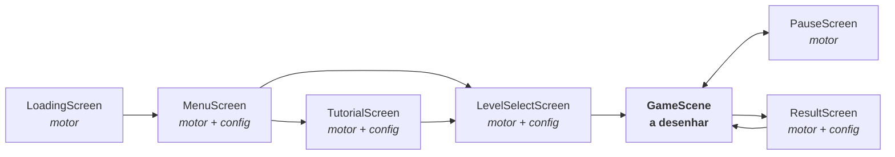

# PLANO-VISUAL-JOGO-DAS-FORMAS.md — layout e direção visual

Plano visual do **Jogo das Formas** (`jogo-das-formas`). Especifica o que aparece na tela, com
que tamanho e em que posição, usando **apenas o que o motor já sabe desenhar**.

Companheiro obrigatório: [`REGRAS-JOGO-DAS-FORMAS.md`](REGRAS-JOGO-DAS-FORMAS.md) — mecânica,
níveis, pontuação e contrato. Nenhum número de jogo se repete aqui: número copiado à mão
envelhece.

Fonte de todos os valores de cor, espaço, tipo e tempo: `engine/theme/tokens.js`. **Este
documento não escreve nenhum hexadecimal** — cita o token.

---

## 1. A afirmação central: seis das sete telas já estão desenhadas

O motor entrega `LoadingScreen`, `MenuScreen`, `TutorialScreen`, `LevelSelectScreen`,
`PauseScreen` e `ResultScreen` prontas. Elas leem do `config.js` exatamente sete campos —
`titulo`, `subtitulo`, `mascote`, `niveis`, `tutorial`, `tema`, `audio` — e nada mais.

**Então o trabalho visual deste jogo é: preencher esses sete campos, e desenhar a `GameScene`.**
Uma tela por fazer, não sete. É isso que torna este plano viável em vez de um desejo.



---

## 2. Quase zero arquivo de imagem

O original 870298 carrega **34 imagens** — `BG.jpg`, `tronco.png`, `relogio.png`,
`BlocoCirculo.png` e companhia. Esta refação carrega **quatro**, e são emprestadas: os
azulejos das formas, reaproveitados do original como andaime até a arte definitiva
(seção 3.2). Todo o resto é vetorial, desenhado a cada quadro:

| Elemento | Como |
|---|---|
| Céu, sol, nuvens, colinas | `Background` (`tema: 'construcao'`) |
| Azulejos e as quatro formas | `Sprite` **hoje** (andaime), `Shape` **no alvo** — ver 3.1 e 3.2 |
| Trilho, garra, corrente, chão | `Shape` com `desenharPersonalizado` |
| Painéis, cartões, botões, barras | `Panel`, `Button`, `IconButton`, `ScoreBar`, `TimerBar` |
| Mascote | `Mascot` no modo **coruja vetorial** (o padrão) |
| Ícones | `icons.js` — `jogar`, `pausa`, `som`, `casa`, `estrela`, `setaEsquerda`, `setaDireita`, `reiniciar` |

Consequências práticas, não estéticas: a pasta do jogo fica pequena, a arte é nítida em
qualquer resolução e em qualquer zoom do `Stage`, e **a entrega não espera nada de ilustrador
no caminho crítico** — o que falta e não existe é locução (seção 9 do documento de regras).

---

## 3. Os quatro blocos

Cada bloco é um **azulejo** com a forma desenhada dentro. O azulejo dá a leitura de "parede"
quando a pilha cresce; a forma dentro dele é o conteúdo pedagógico. É o modelo do original, e
ele está certo — a refação o mantém.

**A célula da grade é 64 px** em qualquer fase (é o alvo tocável, seção 4.2). O que muda entre
o andaime e o alvo é só o que se desenha dentro dela.

### 3.1 Alvo — azulejo vetorial

**Azulejo:** 60×60 px lógicos, centrado na célula de 64 (a folga de 4 px separa um bloco do
vizinho sem precisar de linha divisória). Canto `raio.sm`, preenchimento `superficie`, contorno
`linha`, sombra `suave`.

**A forma dentro**, centrada, ocupando cerca de 40 px:

| Forma | `Shape` | Tamanho | Cor (token) |
|---|---|---|---|
| Círculo | `forma: 'circulo'` | raio 20 | `ludica.azul` |
| Quadrado | `forma: 'retangulo'`, raio 6 | 36 × 36 | `ludica.laranja` |
| Triângulo | `forma: 'poligono'`, `lados: 3` | raio 22 | `ludica.verde` |
| Retângulo | `forma: 'retangulo'`, raio 5 | 44 × 24 | `ludica.roxo` |

O triângulo nasce com a ponta para cima sem nenhum ajuste: o `Shape` gira o polígono −90° de
propósito.

### 3.2 Andaime — os azulejos de 2013

**Decisão de 2026-08-24:** a primeira versão jogável usa os PNG do original, e a arte vetorial
de 3.1 entra depois. O visual do bloco não é o risco desta entrega — o risco é `GridBoard` e o
modo `colunas` estreando, o ciclo vertical da garra e a linha nova. Emprestar a arte tira a
única espera de terceiros do caminho e deixa a mecânica ser jogada antes de existir arte nova.

| Arquivo (origem: `Aulas para Refazer/Jogo das Formas/images/`) | Forma | Aparência |
|---|---|---|
| `BlocoCirculo.png` | círculo | azulejo amarelo, círculo alaranjado dentro |
| `blocoQuadrado.png` | quadrado | azulejo azul, quadrado azul-escuro dentro |
| `blocoTriangulo.png` | triângulo | azulejo vermelho, triângulo vinho dentro |
| `BlocoRetangulo.png` | retângulo | azulejo verde, retângulo verde-escuro dentro |

Todos 50×50 px, RGBA, 1,3 a 2,1 KB. Copiados para `assets/img/` do jogo — nada fica apontando
para fora da pasta, e o `verificar-independencia.mjs` continua aprovando.

**Desenhar no tamanho nativo, 50 px, centrado na célula de 64.** Não esticar para 60: a folga
de 7 px de cada lado vira a separação entre blocos, que 3.1 desenharia de propósito de todo
jeito, e evita um passo de ampliação de graça.

**Por que isto é andaime e não decisão.** O `Stage` renderiza em `escala × dpr`, com dpr
limitado a 2 (`Stage.js`). Um PNG de 50 px chega ampliado assim:

| Cenário | No nativo (50 px) | Esticado a 60 px |
|---|---|---|
| Notebook 1366×768 | 1,00× | 1,20× |
| Monitor 1080p cheio | 1,50× | 1,80× |
| **Notebook retina 1080p** | **3,00×** | **3,60×** |
| Monitor 1440p | 2,00× | 2,40× |
| iPad deitado | 1,84× | 2,21× |

Três vezes num notebook retina comum é borrão, e ampliar arte pequena é parente do defeito que
o `MOTOR.md` lista como pecado do original ("cortado ou minúsculo em tablet"). Somem-se dois
problemas menores: a sombra e o degradê estão **assados** no PNG, então `sombras.suave` não se
aplica de forma coerente com o resto da tela; e as cores do azulejo ficam **fora dos tokens**,
o que o `DESIGN.md` chama de defeito.

**A costura, que é a parte que importa.** Uma função só na cena de partida:

```js
// Sprite hoje, Shape quando a arte chegar. Nada mais na cena sabe qual é.
criarBloco(tipo) -> Node
```

Sem essa função nomeada, "por enquanto" é permanente. A diferença entre um andaime e uma
dívida é alguém ter escrito onde ela está — e é por isso que este bloco de texto existe.

### 3.3 Por que aqui não há símbolo interno

A regra 3 do `DESIGN.md` — cor nunca é o único portador de significado — está cumprida pela
própria peça: **neste jogo o portador é a forma**, e a cor é reforço redundante. Um círculo
continua sendo um círculo em escala de cinza.

Isso corrige um item herdado da versão anterior deste plano, que pedia "símbolo interno
daltonismo-friendly" em cada bloco. Aquele requisito é real, mas é do **Jogo das Cores**, onde
a cor É o conteúdo e sem símbolo a atividade fica inacessível. Copiá-lo para cá acrescentaria
ruído dentro de uma peça de 60 px, escondendo a forma que a criança precisa reconhecer.

O par que de fato se confunde nesta idade é **quadrado × retângulo** — um é o outro esticado. A
distinção vem por dois canais ao mesmo tempo: proporção claramente diferente (1:1 contra
quase 2:1) e cor bem separada (`laranja` contra `roxo`).

---

## 4. A `GameScene` — a única tela a desenhar

Área lógica **1280×720**. Todas as coordenadas abaixo são px lógicos; o `Stage` escala.

```
 0                                                                        1280
 ┌──────────────────────────────────────────────────────────────────────────┐ 0
 │ [★ PONTOS 12/16 ]        [⟳ tempo ▓▓▓▓▓▓░░░ ]           [⏸]  [🔊]      │
 ├──────────────────────────────────────────────────────────────────────────┤ 88
 │  ╔══════════════════ trilho da garra ══════════════════╗                 │ 104
 │                          ║                                               │
 │                        [garra]                            ┌────────────┐ │
 │                                                           │ AS FORMAS  │ │ 216
 │                    ┌──────────────────┐                   │            │ │
 │                    │                  │                   │  ● CÍRCULO │ │
 │                    │   grade 6×7      │                   │  ■ QUADRADO│ │
 │       (coruja)     │   64 px/célula   │                   │  ▲ TRIÂNGULO│ │
 │         ◕‿◕        │                  │                   │  ▬ RETÂNGULO│ │
 │                    │                  │                   └────────────┘ │
 │                    └──────────────────┘                                  │ 664
 │ ▓▓▓▓▓▓▓▓▓▓▓▓▓▓▓▓ chão de madeira ▓▓▓▓▓▓▓▓▓▓▓▓▓▓▓▓▓▓▓▓▓▓▓▓▓▓▓▓▓▓▓▓▓▓▓▓▓ │
 └──────────────────────────────────────────────────────────────────────────┘ 720
                     448              832
```

### 4.1 HUD — a banda de 0 a 88

| Elemento | Posição | Detalhe |
|---|---|---|
| `ScoreBar` dos pontos | `x: espaco.md`, `y: espaco.md`, 360×34 | `icone: 'estrela'`, `mostrarNumeros: true`. Ligada por `acompanhar(placar)`: passa a se atualizar sozinha |
| `TimerBar` | centralizada, `y: espaco.md`, 360×34 | `icone: 'reiniciar'`, sem números — a criança não lê relógio |
| `IconButton` pausa | `x: L - 180`, `y: espaco.md`, 64×64 | `icone: 'pausa'` |
| `SoundToggle` | `x: L - 96`, `y: espaco.md`, 64×64 | preferência persistida pelo `Storage` |

A `TimerBar` já faz sozinha o aviso que importa: **muda de cor a 35% e a 15% do tempo, e pulsa
no trecho crítico**. Aviso que não depende de saber ler número, e que o original não tinha —
lá o relógio era um ponteiro girando numa timeline.

Os dois botões da direita ficam a 64 px de lado e a 20 px um do outro, acima do mínimo de
`acessibilidade.espacoEntreAlvos`.

### 4.2 A grade

Célula de **64 px** — exatamente `acessibilidade.alvoMinimo`. Não é coincidência: a coluna é o
alvo tocável do jogo, e amarrar a célula ao mínimo de acessibilidade impede que um ajuste
visual futuro produza um alvo pequeno demais sem ninguém perceber.

| | Nível 1 | Níveis 2 e 3 |
|---|---|---|
| Colunas | 5 | 6 |
| Largura | 320 | 384 |
| `x` | 480 → 800 | 448 → 832 |

Sete linhas × 64 = **448** de altura. Base da pilha em `y: 664`; uma pilha cheia chega a
`y: 216`.

**O alvo tocável de cada coluna é a faixa inteira** — 64 px de largura por toda a altura da
área de jogo, do trilho ao chão. A criança não precisa acertar um bloco; basta tocar do lado
certo da tela.

### 4.3 O trilho e a garra

Trilho em `y: 104`: barra horizontal de `tintaSuave` com rebites, atravessando a largura da
grade mais uma margem. A garra pende dele por uma corrente e desce até o topo da pilha.

**A folga vertical é intencional e comunica.** Entre o trilho (104) e o topo de uma pilha cheia
(216) há 112 px — menos de dois blocos. Quando a pilha está quase no teto e a garra carrega
três blocos, a carga chega perto do trilho e a tela fica visivelmente apertada. É o aviso de
"você está perdendo" antes de o jogo terminar, e sai de graça da geometria.

### 4.4 Os dois painéis laterais

A grade ocupa 384 dos 1280 px de largura — a mesma proporção do original (300 de 800). Sobram
duas faixas de cerca de 440 px, e elas não ficam vazias:

**Esquerda — o mascote.** `Mascot` vetorial, 180 px, apoiado no chão de madeira. Reage à
partida: pula a cada combo, inclina quando a pilha passa da quinta linha, encolhe na derrota.
É linguagem corporal, não texto, e é assim que um público que não lê recebe retorno.

**Direita — o painel "AS FORMAS".** `Panel` de 360 px em `x: 880`, listando **as formas em jogo
naquele nível**, cada uma com a peça vetorial de verdade ao lado do nome em caixa alta.

Este painel não é enfeite para preencher espaço: é o objetivo pedagógico exposto na tela
durante a partida inteira. A criança que esqueceu qual é o triângulo olha para o lado. E ele
diferencia visualmente o Nível 1 do Nível 3 sem nenhum rótulo de dificuldade — três linhas
contra quatro.

**Tocar numa linha do painel narra o nome da forma.** É o único elemento interativo fora da
grade, custa uma linha de código (o áudio já está carregado) e transforma o painel de
referência em consulta ativa.

---

## 5. Movimento

Direção do `DESIGN.md`: curto, previsível, nada pisca, nada se move sem motivo. Toda duração
sai de `movimento`; todo amortecimento de `Easing`.

| O quê | Duração | Easing | Por quê |
|---|---|---|---|
| Garra deslizando entre colunas | `movimento.padrao` (240 ms) | `suaveSaida` | Rápida o bastante para não frustrar |
| Garra descendo | 350 ms | `suaveEntrada` | Acelera ao descer, como peso caindo |
| Garra subindo com carga | 350 ms | `suaveSaida` | Desacelera ao chegar, como motor freando |
| Combo desaparecendo | `movimento.padrao` | `suaveSaida` | Escala 1,15 + alfa a 0, junto com a narração da forma |
| Blocos caindo por gravidade | `movimento.padrao` | `quicarSaida` | O quique é o que faz "assentou" ser lido sem som |
| Linha nova subindo | `movimento.lento` (420 ms) | `suave` | Devagar de propósito: é a ameaça, e precisa ser vista |
| Bloco-estrela nascendo | `movimento.entrada` | `costasSaida` | O leve exagero marca a recompensa |
| Coruja pulando no combo | `movimento.padrao` | `quicarSaida` | — |

**Nada anima em cima de outra animação.** Durante a descida e a subida da garra o toque está
travado (regra da seção 4.2 do documento de regras), e a cascata de combos é sequencial: um elo
termina antes do próximo começar. Duas peças se movendo ao mesmo tempo por motivos diferentes é
o que deixa uma tela ilegível para uma criança de 4 anos.

O brilho do combo é **escala + alfa**, nunca piscar. `brilho1/2/3.png` do original eram três
quadros de flash alternando — exatamente o que a regra 4 proíbe.

---

## 6. O que preencher no `config.js`

O trabalho visual das seis telas do motor é este, e só este:

| Campo | Conteúdo |
|---|---|
| `titulo` | `Jogo das Formas` |
| `subtitulo` | `Junte três formas iguais!` |
| `tema` | `'construcao'` — o mesmo canteiro do piloto, para as duas aulas parecerem da mesma coleção |
| `mascote` | sem `asset`: coruja vetorial |
| `niveis[]` | `id`, `nome`, `descricao`, `amostra`, `cor`, e os campos de mecânica |
| `tutorial[]` | três passos, com `titulo`, `texto`, `fala` e a função `desenho` |
| `audio` | `musica`, `erro`, `vitoria`, `derrota`, `abertura` |

### As cores dos cartões de nível

`nivel.cor` pinta o cartão na `LevelSelectScreen`. **Não usar verde/amarelo/vermelho**, que
é semáforo de dificuldade — e os três níveis aqui são o mesmo jogo com mais espaço para
pensar, não fácil/médio/difícil (seção 6 do documento de regras). O piloto já resolveu isto
usando `primaria`, `secundaria` e `acerto`, e a mesma escolha serve aqui.

### O campo `amostra`

A `LevelSelectScreen` desenha `amostra` como **uma linha de texto centrada** em
`tipografia.corpo`, sem quebra. `"CÍRCULO QUADRADO TRIÂNGULO"` transbordaria o cartão.

A solução são os caracteres geométricos do Unicode, que existem na fonte do sistema e mostram
a forma em vez de nomeá-la:

| Nível | `amostra` |
|---|---|
| 1 | `● ■ ▲` |
| 2 e 3 | `● ■ ▲ ▬` |

**Risco a verificar no navegador, não presumir:** se algum destes glifos faltar em alguma
plataforma, aparece o retângulo de "caractere ausente". É item de checklist do
`teste-navegador.mjs`, e a saída de reserva é `3 FORMAS` / `4 FORMAS`.

---

## 7. O que este plano não usa

Fora dos quatro azulejos emprestados (seção 3.2), a arte de 2013 fica em
`Aulas para Refazer/` para consulta e nada dela é publicado:

| Original | Por que sai |
|---|---|
| `BG.jpg`, `Landscapechamomile7.jpg` | Fundo fotográfico atrás de peças vetoriais briga com elas; o `Background` dá céu e cenário coerentes com o resto do motor |
| `relogio.png`, `relogioCapa.png`, `relogioFundo.png` | O relógio analógico exige leitura de ponteiro. A `TimerBar` avisa por cor e pulso |
| `Blocolosango.png` | **Visualmente indistinguível de `BlocoRetangulo.png`** — mesmo azulejo verde com um retângulo dentro, bytes diferentes, aparência igual. Segundo motivo independente para o losango ficar fora, além de não ter locução |
| `brilho1/2/3.png` | Flash alternando é piscar (regra 4 do `DESIGN.md`) |
| `coruja1/2/3.png`, `estrela1/2/3.png` | `Mascot` vetorial e `icons.estrela` |
| `tronco.png`, `troncoArea.png` | Chão e cenário vêm do `Background` e de `Shape` |
| `tutorial1.jpg`, `instrucoes1/2.png` | Os passos do tutorial são animação vetorial, não imagem estática |
| `seta1/2/3.png` | `icons.setaEsquerda` / `setaDireita` |
| `barraPontosExterna/Interna.png` | `ScoreBar` |
| `logo.png` | Título em `TextNode` com contorno |

---

## 8. Viabilidade, peça por peça

| O que a tela precisa | Existe? |
|---|---|
| Céu, sol, nuvens, chão | `Background` — **pronto** |
| Azulejo e as quatro formas | `Sprite` sobre os PNG de 2013 — **andaime, pronto**. `Shape` cobre as quatro nativamente quando a arte chegar (3.1) |
| Trilho, garra, corrente | `Shape` com `desenharPersonalizado` — **a desenhar na cena** |
| Barra de pontos | `ScoreBar.acompanhar(placar)` — **pronto** |
| Cronômetro com aviso | `TimerBar` — **pronto**, estreia aqui |
| Pausa e som | `IconButton` + `SoundToggle` — **pronto** |
| Mascote reagindo | `Mascot` vetorial, 5 expressões — **pronto** |
| Painel lateral | `Panel` + `Shape` + `TextNode` — **pronto** |
| Grade, combos, gravidade | `GridBoard` — **pronto**, estreia aqui |
| Garra por colunas | `CraneController` modo `colunas` — **pronto**, testado só em unidade |
| Ciclo vertical da garra | `Tween` — **a escrever na cena** |
| Linha nova subindo | `Tween` + deslocamento da grade — **a escrever na cena** |
| Estrelas por percentual | a cena passa `estrelas` — **nada a fazer no motor** |

**Nenhuma mudança no motor é pré-requisito deste plano.** O que falta é a `GameScene` e os sete
campos do `config.js`.

As duas peças que estreiam sem uso real — `GridBoard` e o modo `colunas` — são o risco técnico
da entrega. O risco visual é outro e mora num lugar só: **a folga de 112 px entre o trilho e a
pilha cheia**, que é o único número deste plano que não dá para conferir sem jogar. Se
apertar, a saída é a célula cair de 64 para 60 px — e aí o alvo tocável passa a ficar abaixo do
mínimo, o que precisa ser uma decisão registrada, não um ajuste silencioso.

---

## 9. O que só o olho verifica

O `teste-navegador.mjs` prova que as telas abrem e que a partida percorre o fluxo. Não prova
nada disto:

- [ ] Os glifos `● ■ ▲ ▬` aparecem nos cartões de nível — em Chrome, Edge e num tablet
- [ ] **Os azulejos de 50 px são aceitáveis num notebook retina** (3,00× de ampliação) — é a
      medida que decide se o andaime da seção 3.2 aguenta ir ao ar ou tem de ser trocado antes
- [ ] Quadrado e retângulo são distinguíveis a dois metros de um projetor de sala
- [ ] Uma pilha de sete linhas com a garra carregada não fica ilegível
- [ ] A coruja reage sem competir com a grade pela atenção
- [ ] O painel "AS FORMAS" é lido como referência, e não como algo para arrastar
- [ ] A troca de cor da `TimerBar` é percebida sem ninguém apontar
- [ ] Girado, num celular de pé, tudo acima continua verdadeiro
